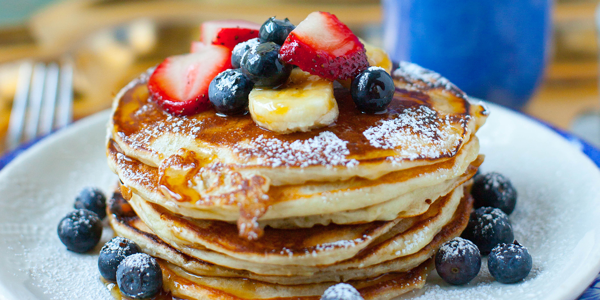

# Marie's Pancakes

**Tags:** Breakfast

> Never overmix the batter. A few lumps are a good sign.

## Ingredients

* 250g all-purpose flour
* 2 tbsp sugar
* 2 tsp baking powder
* 1/2 tsp salt
* 2 eggs
* 300ml milk
* 30g butter, melted
* 1 tsp vanilla extract

## Steps

1. Whisk together flour, sugar, baking powder, and salt in a large bowl.
2. In a separate bowl, beat eggs, milk, melted butter, and vanilla.
3. Pour wet ingredients into dry ingredients and stir gently until just combined.
4. Let the batter rest for 5 minutes.
5. Heat a lightly buttered skillet over medium heat.
6. Pour small ladlefuls of batter onto the skillet and cook until bubbles form on the surface.
7. Flip and cook until golden brown on the other side.
8. Serve immediately with butter and maple syrup.

## Notes

The secret is patience on step 4. Resting the batter gives softer pancakes and a better rise. Keep the heat moderate — too hot and the outside browns before the center cooks through.

## Commit History

| version | date       | message                                               |
| ------- | ---------- | ----------------------------------------------------- |
| v1      | 2024-03-12 | Exactly as found                          |
